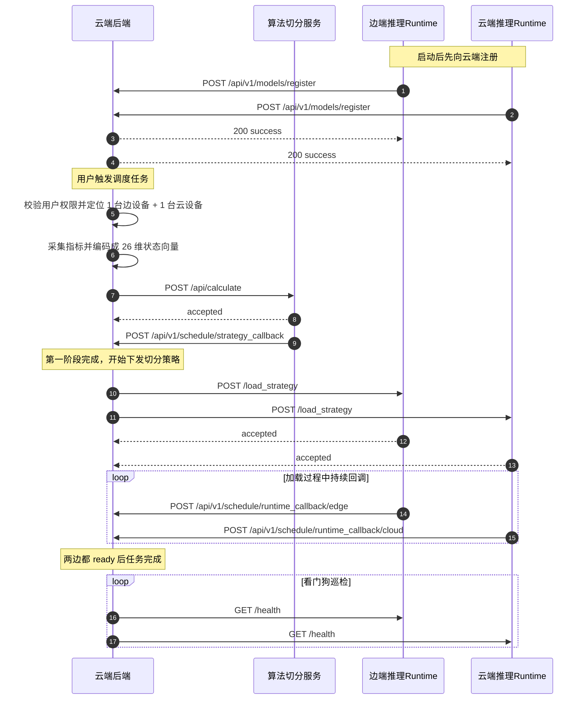

# 边云模型推理服务对接说明

本文档用于说明真实的边端模型推理服务与云端模型推理服务，如何与云端调度后端对接。

当前这两类推理服务对接的是**控制面接口**，主要包括：

1. 服务启动后向云端后端注册自己
2. 云端后端在调度时根据用户设备权限找到对应的边端/云端 runtime
3. 云端后端将算法切分策略下发给 runtime
4. runtime 异步回调模型加载进度
5. 云端后端通过健康检查维护节点在线状态

当前默认假设：

- 一个模型服务对应一个独立端口
- 边端与云端 runtime 注册时，每个模型各自注册一次
- 云端后端根据 `model_key + ip_address + port` 识别该节点
- `device_id`、`node_role`、`service_type`、`control_path` 由云端后端自动推断或补全

当前还**不涉及**边端与云端之间真实推理中间结果的传输，例如：

- hidden states
- KV cache
- token 流
- 中间层激活值

这些后续如果要做协同推理数据面，再单独设计。

## 1. 当前对接范围

本次需要对接的接口包括：

- `POST /api/v1/models/register`
- `POST /api/v1/models/unregister`
- `POST /load_strategy`
- `POST /api/v1/schedule/runtime_callback/edge`
- `POST /api/v1/schedule/runtime_callback/cloud`
- `GET /health`

其中：

- `register` / `unregister` / `health` 用于节点注册与保活
- `load_strategy` 用于云端后端向 runtime 下发切分策略
- `runtime_callback/edge` 用于边端 runtime 回传加载进度
- `runtime_callback/cloud` 用于云端 runtime 回传加载进度

## 2. 基本地址

云端调度后端基础地址示例：

```text
http://10.144.144.2:8010
```

统一 API 前缀：

```text
/api/v1
```

说明：

- runtime 注册到云端后端时，必须上报一个**对云端后端可达**的 `ip_address` 和 `port`
- 云端后端下发策略时，会按这个地址直接访问 runtime
- runtime 收到策略后，会按固定配置回调云端后端的进度接口

## 3. 整体运行流程

边云 runtime 侧看到的完整流程如下：

1. 边端 runtime 启动
2. 边端 runtime 调云端后端 `/api/v1/models/register`
3. 云端 runtime 启动
4. 云端 runtime 调云端后端 `/api/v1/models/register`
5. 云端后端根据 `ip_address` 自动匹配本地设备资产，补全 `device_id` 和 `node_role`
6. 云端后端把这两个节点记录到 `model_nodes` 表，并标记为 `online`
7. 边端前端触发 `/api/v1/schedule/trigger`
8. 云端后端先走用户鉴权、设备权限判断、环境指标采集、状态向量编码、算法策略计算
9. 算法回调成功后，云端后端根据用户分配的 `edge_device_id` 和 `cloud_device_id` 查找对应 runtime
10. 云端后端分别向边端 runtime 和云端 runtime 发 `POST /load_strategy`
11. 边端 runtime / 云端 runtime 收到后立即返回 `accepted`
12. 两边在后台开始加载模型，并持续回调各自固定的进度接口
13. 云端后端聚合两边进度，更新任务状态
14. 当两边都回调 `progress=100` 且状态为 `ready/completed` 时，任务结束
15. 云端后端后台看门狗持续调用 runtime 的 `/health`，判断节点是否还在线

## 4. 时序图说明



## 5. 节点注册接口

这是边端/云端 runtime 启动后首先需要调用的接口。

### 接口地址

```http
POST /api/v1/models/register
```

### 请求头

```http
Content-Type: application/json
```

### 请求体

```json
{
  "model_key": "llama-3.2-3b",
  "ip_address": "10.144.144.3",
  "port": 8001
}
```

### 字段说明

- `model_key`
  - 必填
  - 建议直接使用云端调度系统内部使用的模型标识
  - 例如：
    - `gpt2`
    - `tinyllama`
    - `llama-3.2-3b`
  - 当前假设一个模型服务对应一个独立端口，所以每个模型单独注册一次

- `ip_address`
  - 必填
  - 云端后端访问该 runtime 时使用的地址
  - 云端后端也会根据它去匹配这台机器是哪一个已录入设备

- `port`
  - 必填
  - runtime 暴露控制接口的端口

### 云端后端会自动补全什么

runtime 不需要再主动发送下面这些字段：

- `device_id`
- `node_role`
- `service_type`
- `control_path`
- `model_name`
- `supported_models`

云端后端当前会自动处理为：

- `device_id`
  - 根据 `ip_address` 在本地 `devices` 表中反查

- `node_role`
  - 根据设备的 `device_type` 推断：
    - `cloud -> cloud`
    - 其它 -> edge

- `service_type`
  - 固定补为 `runtime`

- `control_path`
  - 固定补为 `/load_strategy`

- `model_name`
  - 当前直接等于 `model_key`

### 成功响应示例

```json
{
  "status": "success",
  "message": "节点 10.144.144.3:8001 注册成功"
}
```

## 6. 节点下线接口

如果 runtime 正常关闭，建议主动通知云端后端。

### 接口地址

```http
POST /api/v1/models/unregister
```

### 请求体

```json
{
  "ip_address": "10.144.144.3",
  "port": 8001
}
```

### 说明

- 这是正常关闭时的主动下线通知
- 即使没有主动调用，云端后端的看门狗也会通过 `/health` 失败后把节点标记成 `offline`

## 7. 策略下发接口

这是 runtime 需要暴露给云端后端的控制接口。

### 接口地址

```http
POST /load_strategy
```

当前控制接口路径固定约定为：

```text
/load_strategy
```

### 请求头

```http
Content-Type: application/json
```

### 请求体结构

```json
{
  "task_id": "01961862-c3a9-4e37-ad69-16c262fbfc9e",
  "model_type": "gpt2",
  "decision": {
    "layer_partitions": [
      {
        "layer_id": 0,
        "head_assignments": [0, 0, 1, 1, 0, 1, 0, 0, 1, 1, 0, 1],
        "ffn_assignment": 1
      },
      {
        "layer_id": 1,
        "head_assignments": [0, 0, 0, 1, 0, 1, 0, 0, 1, 1, 0, 1],
        "ffn_assignment": 0
      }
    ]
  }
}
```

### 字段说明

- `task_id`
  - 当前调度任务唯一 ID

- `model_type`
  - 当前要加载的模型名

- `decision`
  - 算法模块返回的切分策略
  - runtime 应根据该字段决定本端需要加载哪些层、哪些 head、哪些 FFN
  - 当前 `decision` 中只保留真正的切分结果 `layer_partitions`
  - 不再重复携带 `task_id` 和 `model_type`

### runtime 收到后应如何处理

推荐行为：

1. 先快速校验请求体是否合法
2. 如果已成功受理加载任务，立即返回 `accepted`
3. runtime 根据自身部署形态判断自己是边端还是云端，不再依赖请求体中的 `node_role`
4. 在后台异步进行模型加载
5. 在加载过程中持续调用本端固定的回调接口
6. 加载完成后再回调一次 `progress=100`

### 固定回调地址约定

当前默认假设云端后端地址在内网中长期稳定，因此不再在 `/load_strategy` 请求体中下发 `callback_url`。

- 边端 runtime 固定回调：
  - `POST http://10.144.144.2:8010/api/v1/schedule/runtime_callback/edge`
- 云端 runtime 固定回调：
  - `POST http://10.144.144.2:8010/api/v1/schedule/runtime_callback/cloud`

如果后续云端后端地址发生变化，再统一调整 runtime 本地配置即可。

### 成功响应示例

```json
{
  "status": "accepted",
  "message": "runtime loading started"
}
```

### 失败处理建议

如果 runtime 无法受理任务，建议直接返回 4xx/5xx，并在响应中带出错误说明。  
云端后端收到下发失败后，会把调度任务标记为失败。

## 8. 运行时进度回调接口

这是 runtime 在后台加载模型时，需要调用的接口。

### 接口地址

边端 runtime：

```http
POST /api/v1/schedule/runtime_callback/edge
```

云端 runtime：

```http
POST /api/v1/schedule/runtime_callback/cloud
```

### 请求头

```http
Content-Type: application/json
```

### 请求体

```json
{
  "task_id": "01961862-c3a9-4e37-ad69-16c262fbfc9e",
  "status": "loading",
  "progress": 45,
  "message": "边端正在加载 GPT-2 权重"
}
```

### 字段说明

- `task_id`
  - 必填
  - 标识回调属于哪一个调度任务

- `status`
  - 建议值：
    - `loading`
    - `ready`
    - `completed`
    - `failed`

- `progress`
  - 当前加载进度
  - 范围 `0-100`

- `message`
  - 当前阶段文案
  - 云端后端会直接把它透出给任务状态

### 成功响应示例

```json
{
  "status": "success",
  "message": "加载进度已记录"
}
```

### 完成判定规则

云端后端当前的完成条件是：

- 边端 `progress >= 100`
- 云端 `progress >= 100`
- 边端 `status in {"ready", "completed"}`
- 云端 `status in {"ready", "completed"}`

只要两边都满足，任务才会进入：

```text
status = completed
```

### 失败判定规则

如果任意一边回调：

```json
{
  "status": "failed"
}
```

云端后端会立即把整个调度任务标记失败。

### 为什么不再需要 `node_role`

当前通过不同的固定回调接口区分边端和云端：

- 边端 runtime 回调：
  - `/api/v1/schedule/runtime_callback/edge`
- 云端 runtime 回调：
  - `/api/v1/schedule/runtime_callback/cloud`

因此回调请求体中不再需要单独传 `node_role`。

## 9. 健康检查接口

runtime 需要提供一个健康检查接口给云端后端看门狗使用。

### 接口地址

```http
GET /health
```

### 成功响应示例

边端 runtime：

```json
{
  "status": "ok",
  "node_role": "edge"
}
```

云端 runtime：

```json
{
  "status": "ok",
  "node_role": "cloud"
}
```

### 说明

- 云端后端当前每 10 秒巡检一次在线节点的 `/health`
- 若健康检查失败或返回非 2xx，节点会被标记为 `offline`

## 10. 当前云端后端如何选择 runtime

当前云端后端选择 runtime 的逻辑是：

1. 先根据当前用户的设备权限确定：
   - `edge_device_id`
   - `cloud_device_id`
2. 在 `model_nodes` 表中查找：
   - `device_id` 匹配
   - `node_role` 匹配
   - `service_type == "runtime"`
   - `status == "online"`
3. 优先选：
   - `model_key == model_type.lower()`
4. 当前仍兼容历史多模型注册格式：
   - `model_key == "multi"`
   - `model_key == "*"`
   - `model_key == "all"`

所以需要特别注意：

- runtime 注册时上报的 `ip_address` 必须能在云端后端的设备资产表中匹配到正确设备
- runtime 注册后必须保持在线

## 11. 当前推荐的实现方式

### 边端 runtime

建议至少实现：

1. 启动时注册
2. 关闭时注销
3. 每个模型服务实例独立端口运行，并分别注册
4. 暴露 `/load_strategy`
5. 暴露 `/health`
6. 按固定回调接口异步回调加载进度

### 云端 runtime

建议实现方式与边端 runtime 一致，只是部署在云设备对应的机器与端口上。

## 12. 联调建议

### 本地 mock 联调

当前仓库里已经提供了两个 mock：

- [mock_edge_runtime_server.py](/home/nss-d/splitwise_cloud/tests/mock_edge_runtime_server.py)
- [mock_cloud_runtime_server.py](/home/nss-d/splitwise_cloud/tests/mock_cloud_runtime_server.py)

它们已经演示了完整流程：

- 启动时注册
- 接收 `/load_strategy`
- 后台模拟加载
- 回调各自固定的进度接口
- 提供 `/health`

### 完整联调时建议启动

1. 云端后端
```bash
bash ~/splitwise_cloud/scripts/run_server.sh
```

2. 算法 mock
```bash
venv/bin/python ~/splitwise_cloud/tests/mock_algorithm_server.py
```

3. 边端 runtime mock
```bash
venv/bin/python ~/splitwise_cloud/tests/mock_edge_runtime_server.py
```

4. 云端 runtime mock
```bash
venv/bin/python ~/splitwise_cloud/tests/mock_cloud_runtime_server.py
```

5. 边端前端 mock
```bash
venv/bin/python ~/splitwise_cloud/tests/mock_edge_client.py
```

## 13. 当前不需要 runtime 做的事

当前边端/云端 runtime 不需要负责：

- 用户鉴权
- OpenWebUI token 识别
- 用户设备权限匹配
- 算法切分计算
- 前端任务状态展示

这些都由云端后端负责。

## 14. 当前关键结论

边端/云端模型推理服务当前只要完成下面几件事，就能与云端调度后端完成对接：

1. 启动后调用 `/api/v1/models/register`
2. 保证 `model_key`、`ip_address`、`port` 上报正确
3. 暴露 `/load_strategy`
4. 收到策略后异步加载模型
5. 通过固定回调接口持续上报加载进度
6. 暴露 `/health`
7. 关闭时调用 `/api/v1/models/unregister`

如果以上都满足，云端后端就可以把算法切分策略正确地下发给边端和云端 runtime，并基于两边回调推进整个调度任务状态。
