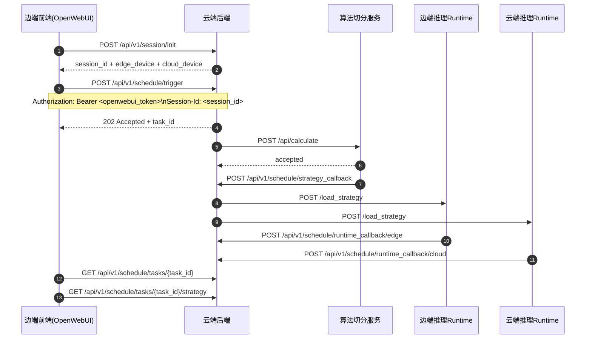

# 边端前端对接说明

本文档说明基于 OpenWebUI 的边端前端，如何与云端调度后端完成当前版本的对接。

## 0. 新旧流程差异速览

和旧版对接方式相比，当前版本有 4 个关键变化：

1. 不再调用 `POST /api/v1/auth/exchange`
   - 旧流程：先用 OpenWebUI token 换云端后端自己的业务 token
   - 新流程：直接使用 OpenWebUI token，不再额外换 token

2. 新增 `POST /api/v1/session/init`
   - 旧流程：exchange 完 token 后直接发起调度
   - 新流程：先初始化一次会话，传 `edge_device_ip`，拿到 `session_id`

3. 发起调度时需要额外带 `Session-Id`
   - 旧流程：`Authorization: Bearer <cloud_backend_token>`
   - 新流程：`Authorization: Bearer <openwebui_token>` 加 `Session-Id: <session_id>`

4. 前端不再负责设备相关信息
   - 旧流程里虽然前端也没有直接传很多设备参数，但后端还存在旧的本地普通用户绑定思路
   - 新流程中已经明确：
     - 边端设备由前端显式传入 `edge_device_ip`
     - 后端根据 `edge_device_ip` 匹配已登记的边端设备
     - 云端设备当前固定为 `10.144.144.2`

如果边端前端同学之前是按旧版文档开发的，那么现在只需要记住一句话：

**先用 OpenWebUI token + `edge_device_ip` 调 `/api/v1/session/init` 拿 `session_id`，后续再用 `openwebui_token + Session-Id` 调度即可。**

当前前端只需要完成 6 件事：

1. 从 OpenWebUI 读取当前 token
2. 确定当前使用的边端设备 IP
3. 调用云端后端 `POST /api/v1/session/init`
4. 保存返回的 `session_id`
5. 用 OpenWebUI token + `Session-Id` 发起调度任务
6. 查询任务状态，并在需要时拉取切分策略

前端当前不需要负责：

- 传 `username`
- 传边端设备 ID
- 选择云端设备
- 直接与算法服务通信
- 直接与边端/云端推理 runtime 通信

这些都由云端调度后端负责。当前版本中：

- 边端设备：由前端传 `edge_device_ip`，云端后端按设备表进行匹配
- 云端设备：固定为 `cloud`，对应 IP `10.144.144.2`

## 1. 基本地址

云端调度后端基础地址示例：

```text
http://10.144.144.2:8010
```

统一 API 前缀：

```text
/api/v1
```

## 2. 最小对接流程

前端推荐按以下顺序调用：

1. 用户在 OpenWebUI 登录
2. 前端读取 OpenWebUI token
3. 获取当前边端设备 IP
4. 调用 `POST /api/v1/session/init`
5. 保存返回的 `session_id`
6. 用户选择模型后，调用 `POST /api/v1/schedule/trigger`
7. 拿到 `task_id`
8. 轮询或订阅 `GET /api/v1/schedule/tasks/{task_id}` / `stream`
9. 当 `phase = "loading"` 时，如需展示切分策略，调用 `GET /api/v1/schedule/tasks/{task_id}/strategy`
10. 根据 `phase`、`status`、`edge_progress`、`cloud_progress`、`edge_message`、`cloud_message` 更新 UI

## 3. 时序图



## 4. 初始化边端会话接口

### 接口

```http
POST /api/v1/session/init
```

### 请求头

```http
Authorization: Bearer <openwebui_token>
```

### 请求体

```json
{
  "edge_device_ip": "10.144.144.3"
}
```

### 成功响应示例

```json
{
  "session_id": "530c57ad-df64-4eff-af80-f1f5339ce4ef",
  "openwebui_user_id": "4c1edb00-2a96-4cea-9c30-45e0a7782ae7",
  "openwebui_username": "alice",
  "openwebui_role": "user",
  "edge_device": {
    "id": "edge_A",
    "name": "边端 A",
    "type": "edge",
    "ip": "10.144.144.3"
  },
  "cloud_device": {
    "id": "cloud",
    "name": "云端主机",
    "type": "cloud",
    "ip": "10.144.144.2"
  },
  "message": "OpenWebUI token 校验通过，边端设备识别完成，会话初始化成功"
}
```

### 说明

- 这一步会完成 OpenWebUI token 验签
- 这一步会根据前端传入的 `edge_device_ip` 匹配已登记的边端设备
- 这一步会返回本次后续请求要使用的 `session_id`
- 前端当前需要传真实边端模型推理服务所在设备的 IP

## 5. 发起调度任务接口

### 接口

```http
POST /api/v1/schedule/trigger
```

### 请求头

```http
Content-Type: application/json
Authorization: Bearer <openwebui_token>
Session-Id: <session_id>
```

### 请求体

```json
{
  "model_type": "llama-3.2-3b"
}
```

### 说明

- 当前后端支持：
  - `gpt2`
  - `tinyllama`
  - `llama-3.2-3b`
- 前端不需要再传 `edge_device`
- 前端不需要再传 `cloud_device`
- 前端不需要再传 `edge_storage_limit_gb`

### 成功响应示例

```json
{
  "status": "accepted",
  "task_id": "75ec72d7-aa1e-454f-a6d0-8b3de7b270d8",
  "phase": "strategy",
  "phase_progress": 0,
  "overall_progress": 0,
  "message": "任务已受理，开始计算切分策略"
}
```

## 6. 查询任务状态接口

### 接口

```http
GET /api/v1/schedule/tasks/{task_id}
```

### 请求头

```http
Authorization: Bearer <openwebui_token>
```

### 响应示例

```json
{
  "task_id": "75ec72d7-aa1e-454f-a6d0-8b3de7b270d8",
  "status": "running",
  "phase": "loading",
  "phase_progress": 40,
  "overall_progress": 70,
  "message": "边云模型加载中",
  "edge_progress": 45,
  "cloud_progress": 35,
  "edge_status": "loading",
  "cloud_status": "loading",
  "edge_message": "边端正在加载模型权重",
  "cloud_message": "云端正在初始化推理上下文",
  "error_detail": null,
  "created_at": "2026-04-02T06:10:36.649414",
  "updated_at": "2026-04-02T06:10:39.102000"
}
```

### 字段说明

- `status`
  - `accepted` / `running` / `completed` / `failed`
- `phase`
  - `strategy`：第一阶段，计算切分策略
  - `loading`：第二阶段，边云模型加载中
  - `completed`：任务已完成
- `phase_progress`
  - 当前阶段进度，范围 `0-100`
- `overall_progress`
  - 总进度，范围 `0-100`
- `message`
  - 总体状态文案
- `edge_progress`
  - 边端模型加载进度
- `cloud_progress`
  - 云端模型加载进度
- `edge_status`
  - 边端状态，例如 `pending` / `dispatching` / `loading` / `ready`
- `cloud_status`
  - 云端状态，例如 `pending` / `dispatching` / `loading` / `ready`
- `edge_message`
  - 边端当前阶段文案
- `cloud_message`
  - 云端当前阶段文案
- `error_detail`
  - 任务失败时的错误详情

## 7. 获取切分策略接口

如果前端需要展示切分策略，可在任务进入 `loading` 阶段后调用本接口。

### 接口

```http
GET /api/v1/schedule/tasks/{task_id}/strategy
```

### 请求头

```http
Authorization: Bearer <openwebui_token>
```

### 调用时机

建议在任务状态出现：

```json
{
  "phase": "loading"
}
```

之后再调用。

### 成功响应示例

```json
{
  "task_id": "75ec72d7-aa1e-454f-a6d0-8b3de7b270d8",
  "model_type": "llama-3.2-3b",
  "decision": {
    "edge_head_count_total": 336,
    "cloud_head_count_total": 336,
    "layer_partitions": [
      {
        "layer_id": 0,
        "head_assignments": [0, 1, 0, 1, 0, 1, 0, 1, 0, 1, 0, 1, 0, 1, 0, 1, 0, 1, 0, 1, 0, 1, 0, 1],
        "ffn_assignment": 0,
        "edge_head_count": 12,
        "cloud_head_count": 12
      },
      {
        "layer_id": 1,
        "head_assignments": [1, 0, 1, 0, 1, 0, 1, 0, 1, 0, 1, 0, 1, 0, 1, 0, 1, 0, 1, 0, 1, 0, 1, 0],
        "ffn_assignment": 1,
        "edge_head_count": 12,
        "cloud_head_count": 12
      }
    ]
  }
}
```

### 说明

- `decision` 中除了每层明细，还会返回整份策略的总计：
  - `edge_head_count_total`
  - `cloud_head_count_total`
- 实际返回中，`layer_partitions` 会包含完整层数
- 前端可直接使用：
  - `edge_head_count_total`
  - `cloud_head_count_total`
  - `head_assignments`
  - `edge_head_count`
  - `cloud_head_count`
  进行展示
- `head_assignments` 中：
  - `0` 表示该 head 分配给边端
  - `1` 表示该 head 分配给云端

### 失败示例

```json
{
  "detail": "切分策略尚未生成，请在进入 loading 阶段后再拉取"
}
```

## 8. SSE 实时任务状态流

### 接口

```http
GET /api/v1/schedule/tasks/{task_id}/stream?token=<openwebui_token>
```

### 说明

- 当前 SSE 通过 query 参数传 OpenWebUI token
- 如果前端暂时不想接 SSE，继续轮询也可以

### 示例

```javascript
const openwebuiToken = localStorage.getItem("openwebui_token");
const source = new EventSource(
  `http://10.144.144.2:8010/api/v1/schedule/tasks/${taskId}/stream?token=${encodeURIComponent(openwebuiToken)}`
);

source.onmessage = (event) => {
  const task = JSON.parse(event.data);
  console.log(task);
};
```

## 9. 前端展示建议

### 第一阶段

条件：

```text
phase === "strategy"
```

建议展示：

- 标题：正在计算切分策略
- 进度：`phase_progress`
- 文案：`message`

### 第二阶段

条件：

```text
phase === "loading"
```

建议展示：

- 标题：正在加载边云推理模型
- 总进度：`phase_progress`
- 边端进度：`edge_progress`
- 云端进度：`cloud_progress`
- 总文案：`message`
- 边端文案：`edge_message`
- 云端文案：`cloud_message`

### 完成

条件：

```text
status === "completed"
```

### 失败

条件：

```text
status === "failed"
```

建议展示：

- `error_detail`
- `message`

## 10. 最简前端示例

```javascript
async function initSession(openwebuiToken) {
  const res = await fetch("http://10.144.144.2:8010/api/v1/session/init", {
    method: "POST",
    headers: {
      "Authorization": `Bearer ${openwebuiToken}`,
      "Content-Type": "application/json"
    },
    body: JSON.stringify({
      edge_device_ip: "10.144.144.3"
    })
  });
  const data = await res.json();
  if (!res.ok) throw new Error(data.detail || "session 初始化失败");
  localStorage.setItem("edge_session_id", data.session_id);
  return data;
}

async function triggerTask(modelType) {
  const openwebuiToken = localStorage.getItem("openwebui_token");
  const sessionId = localStorage.getItem("edge_session_id");
  const res = await fetch("http://10.144.144.2:8010/api/v1/schedule/trigger", {
    method: "POST",
    headers: {
      "Content-Type": "application/json",
      "Authorization": `Bearer ${openwebuiToken}`,
      "Session-Id": sessionId
    },
    body: JSON.stringify({ model_type: modelType })
  });
  const data = await res.json();
  if (!res.ok) throw new Error(data.detail || "任务发起失败");
  return data;
}

async function getTaskStatus(taskId) {
  const openwebuiToken = localStorage.getItem("openwebui_token");
  const res = await fetch(`http://10.144.144.2:8010/api/v1/schedule/tasks/${taskId}`, {
    headers: {
      "Authorization": `Bearer ${openwebuiToken}`
    }
  });
  const data = await res.json();
  if (!res.ok) throw new Error(data.detail || "获取任务状态失败");
  return data;
}

async function getTaskStrategy(taskId) {
  const openwebuiToken = localStorage.getItem("openwebui_token");
  const res = await fetch(`http://10.144.144.2:8010/api/v1/schedule/tasks/${taskId}/strategy`, {
    headers: {
      "Authorization": `Bearer ${openwebuiToken}`
    }
  });
  const data = await res.json();
  if (!res.ok) throw new Error(data.detail || "获取切分策略失败");
  return data;
}
```

## 11. 常见错误

- `401`
  - OpenWebUI token 无效、过期，或 `Session-Id` 与当前 token 不匹配
- `400`
  - 参数错误或模型名不支持
- `404`
  - 任务不存在，或当前 OpenWebUI 用户无权访问该任务
- `409`
  - 策略还未生成，过早拉取了 `/strategy`
- `500`
  - 算法服务异常、推理节点下发失败或后端内部异常

## 12. 当前关键结论

边端前端现在只要完成下面这些，就能完成对接：

1. 读取 OpenWebUI token
2. 获取真实边端设备 IP
3. 调 `POST /api/v1/session/init`
4. 保存 `session_id`
5. 调 `POST /api/v1/schedule/trigger`
6. 查询 `GET /api/v1/schedule/tasks/{task_id}`
7. 如需展示策略，在 `phase = "loading"` 后调 `GET /api/v1/schedule/tasks/{task_id}/strategy`
8. 根据 `phase`、`status`、`message`、`edge_message`、`cloud_message`、`edge_progress`、`cloud_progress` 更新 UI
